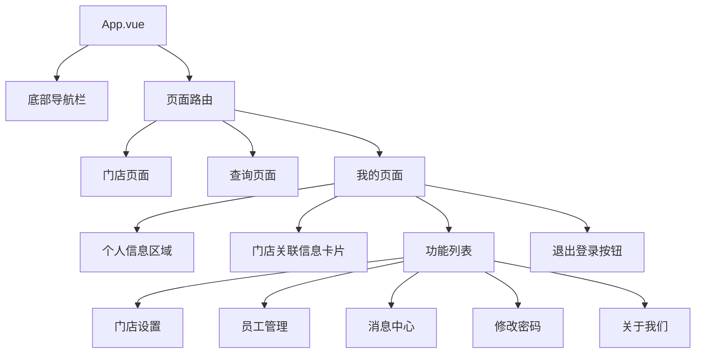

# unibest 电竞风 App 架构设计

## 整体设计风格
- **主色调**: 深邃黑 (#1a1a1a) 与炽热红 (#ff0000)
- **辅助色**: 科技感银灰 (#cccccc)
- **字体**: 锐利、无衬线的现代感字体
- **设计元素**: 硬朗线条、锐利边角，营造科技感和电竞氛围

## 项目结构


## 组件设计规范

### 颜色规范
```scss
// 主要颜色
$dark-bg: #1a1a1a;      // 深邃黑 - 主背景色
$primary-red: #ff0000;   // 炽热红 - 主色调
$secondary-gray: #cccccc; // 银灰 - 文字和图标色
$card-bg: #2a2a2a;       // 卡片背景色
$list-item-bg: #1f1f1f;  // 列表项背景色
```

### 字体规范
- **字体族**: 无衬线现代字体
- **标题**: 18px 白色
- **正文**: 14px 银灰色
- **辅助文本**: 12px 银灰色

### 组件规范

#### 底部导航栏
- 固定三个导航按钮：门店、查询、我的
- 选中状态高亮显示

#### 个人信息区域
- 背景：碳纤维纹理 + 半透明黑遮罩
- 头像：圆形 64px，红色 2px 边框
- 昵称：18px 白色
- 职位：12px 银灰色

#### 门店关联信息卡片
- 背景：#2a2a2a
- 边框：红色边框
- 圆角：4px

#### 功能列表项
- 高度：56px
- 背景：#1f1f1f
- 底部分割线：1px 银灰色
- 交互效果：点击时整行左移显示红色底纹

#### 退出登录按钮
- 满宽红色按钮
- 高度：48px
- 字体：白色粗体 16px
- 圆角：4px
- 点击效果：scale 0.95 缩放 + 200ms 渐变消失动画

## 动画效果
1. 页面元素过渡动画
2. 按钮点击缩放反馈
3. 退出登录按钮渐变消失动画
4. 列表项点击反馈动画